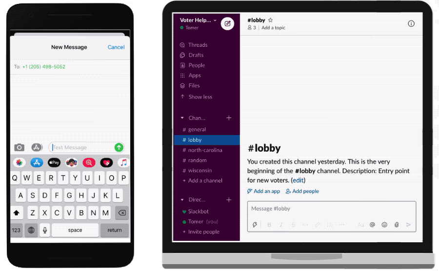
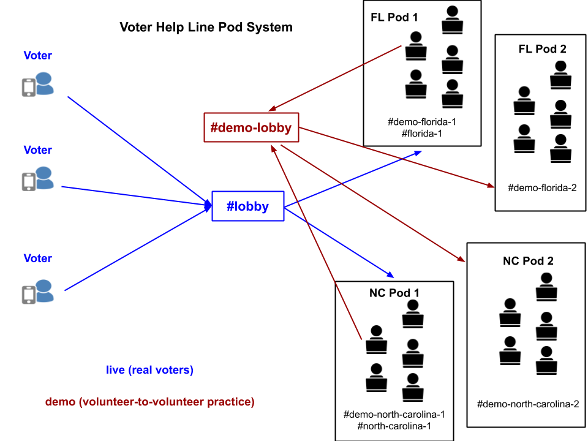

# Voter Help Line

Project that connects **voters** who need help voting with **volunteers** who want to help.

## Idea

The premises behind this project are:
- More people would **vote** if doing so took less of their time.
- People are willing to **volunteer** their time to help other people vote, if there were a convenient way for them to do so.

## Get Involved

Interested in helping people vote? Please **[sign up here](https://docs.google.com/forms/d/e/1FAIpQLSdHJsZjKF72ZSmAptYo1et2ZwfUgDfnImqTcwSjDXuXRSsZVQ/viewform)** or email to volunteer@voterhelpline.org learn more.

We need currently need volunteers to learn voting rules, join our Slack workspace and answer voter questions.

## Demo

Text "DEMO" to **(855) 521-8008** to demo the system.

Text **(855) 212-4406** for help voting on the live system, which currently serves Florida, North Carolina and Ohio.

## Technical Overview

This technology consists of three primary systems:

1. [**Slack App**](https://api.slack.com/), for relaying messages to and from the Slack Workspace used by volunteers,
2. [**Twilio Programmable SMS**](https://www.twilio.com/sms), for relaying texts to and from voters, and
3. [**An Express Node.js server**](https://expressjs.com/) for logic between Slack and Twilio, and any additional app logic (e.g. determining U.S. state of voters). This server is deployed using [Heroku](http://heroku.com/).

These primary technologies are supported by:

1. [**A Redis in-memory database**](http://redis.io/), for looking up a Slack thread given a voter phone number, and vice versa, and
2. [**A PostgreSQL persistent database**](https://www.postgresql.org), for logging all messages relayed to and from voters.

## Features

### Voter Experience

The system immediately greets a voter upon initial message and attempts to automatically ask the voter for the U.S. state in which they are seeking to vote. A voter is then connected directly with a volunteer with expertise in that U.S. state.

If a voter sends a message after having been idle for a set amount of time (currently one hour), the system sends an automated message acknowledging their message and informing them that a volunteer (likely the same volunteer with which they previously communicated) is being sought.

### Volunteer Experience

The system routes voter messages to a Slack workspace, which serves as the interface for volunteers.

Messages in the Slack workspace are organized by:

- **U.S. state**: each U.S. state has a separate Slack channel. This allows the system to handle many states while allowing volunteers to only monitor the channel for the state for which they can help.
- **voter**: when a new voter texts the system, a new Slack thread is created (in the channel according to the U.S. state in which they seek to vote). All subsequent messages from that voter are posted within that same thread, and all messages sent by volunteers within this Slack thread (from any user except the bot) are relayed as a text to the voter.

The system also manages a *#lobby* channel in the Slack workspace, where voter messages are relayed before their U.S. state is determined. This allows volunteers to monitor an incoming voter's messages as the automated system attempts to determine their U.S. state. Volunteers can intervene if a volunteer has difficulty selecting a U.S. state (or doesn't know or want to select one) by messaging in the Slack *#lobby* thread.

Once a U.S. state is determined, a thread is created for the voter in the Slack channel corresponding to that U.S. state (e.g. *#north-carolina*) and the entire chat history of the voter is re-posted to that new thread so that volunteers can see the voter's chat experience and messages up to that point.

In addition to containing threads in which volunteers chat with voters, channels can be used for volunteers to chat with one another. For example, when a new thread is created in *#north-carolina* for a new voter, volunteers can message one another within *#north-carolina* (but outside of the thread itself) to discuss answers to the voter's questions.

Volunteers can also direct message each other or the *#general* channel for guidance on voter questions to which they do not know the answer.

#### Volunteer Pods

This system supports grouping volunteers into separate **"pods"** of 3-6 volunteers each. This allows for easy training, practice, organizational structure and routing of new voters to available volunteers.

As an example, a new pod of North Carolina volunteers may begin using this technology in these steps:

1. The volunteers join a **new *#demo-north-carolina-16* Slack channel** created specifically for this pod's members. The number 16 signifies the pod number assigned to this pod.
2. All volunteers (regardless of pod or U.S. state) **text the Voter Help Line demo line**, pretending to be voters with mock questions.
3. These messages appear in the **#demo-lobby** channel until their U.S. state is determined by the automated system.
4. Once the demo-ing volunteer selects a U.S. state, they are **routed** by "[round-robin](https://en.wikipedia.org/wiki/Round-robin_scheduling)" to one of the Slack demo channels corresponding to their state (e.g. *#demo-north-carolina-16*).
5. A volunteer in the pod **answers the questions**. Each pod is responsible for ensuring one volunteer is active and available to answer questions at any given time during daytime hours in their U.S. state (they can accomplish this using a shared calendar with shifts).
6. The volunteer asking mock questions completes a **feedback form**, which helps Voter Help Line admins determine when the pod is ready to receive real voters.
7. After the pod feels comfortable and demonstrates the ability to answer practice questions well, they are added to a new *#north-carolina-16* Slack channel (non-demo) to which new, **real voters** are routed by round-robin from the *#lobby* channel.
8. New voters' messages stay with the pod to which they are allocated. **Volunteers in that pod are able to follow up** with their voters (given their permission), and **the voter can ask additional questions** days or weeks later and reach the same volunteer.

## Desired Improvements

- **State parsing failure count**: After a certain number of failures at determining in which state a voter would like to vote, the system will mention to the voter that it is seeking a volunteer to help.
- **Admin controls via Slack**: Volunteers will be able to route voters to another U.S. state or reset their Redis memory from the Slack app by mentioning the Slack bot.
- **Done!** ~~Volunteer assignment: Volunteers will be assigned to new voters, prioritized based on their schedules and availability, or by "[round-robin](https://en.wikipedia.org/wiki/Round-robin_scheduling)."~~
- **Done!** ~~Logging: Every message sent between voters and volunteers will be written to a persistent database, for data analysis and monitoring.~~
- **Resilience to edge cases**: The system will be more resilient to unexpected values or paths (e.g. unfound Slack thread or channel).
- **Browser chat**: Voters can choose to chat with a volunteer via the website (instead of via text).
- **Done!** ~~Additional unit tests: Programmers will have additional unit tests that allow them to develop faster without fear of breaking existing features.~~
- **Done!** ~~Separate environments: Programmers will have separate staging and test system environments and Slack workspaces that will allow them to test changes to the system without affecting the volunteer experience.~~
